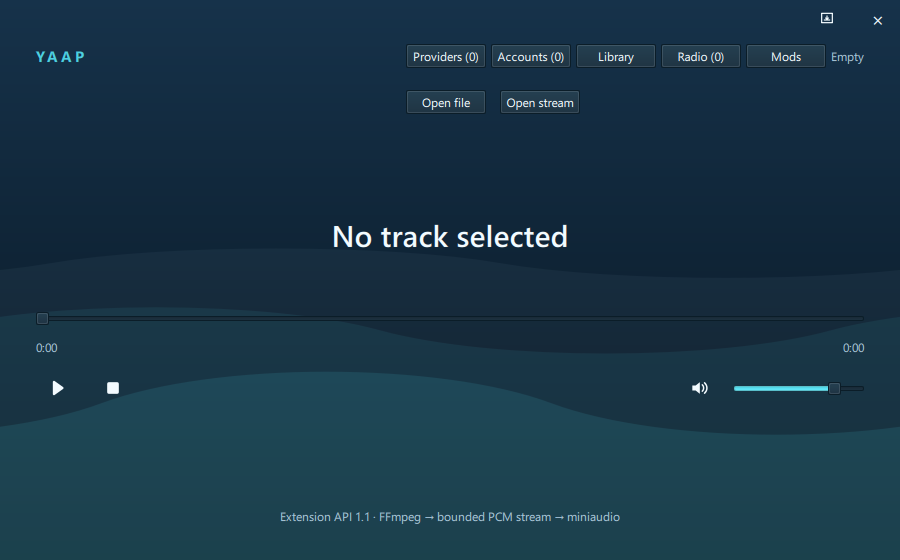
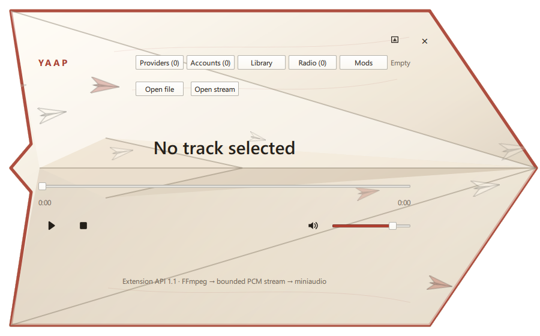
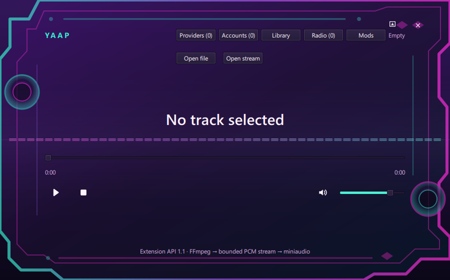
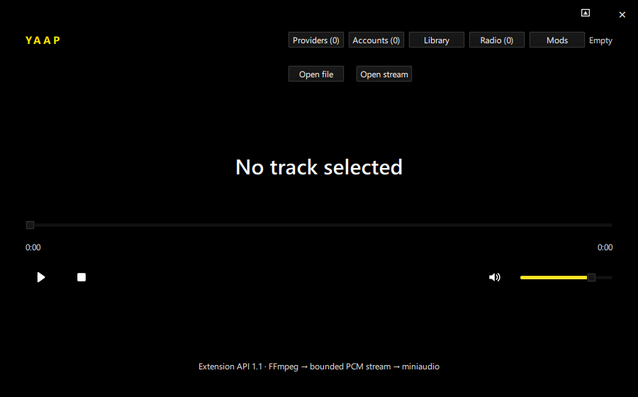

# Yaap

Yaap is a cross-platform C++20 and Qt Quick music player. The current 0.2
prototype plays local files, internet streams, radio stations, OpenSubsonic,
Jellyfin, and out-of-process provider extensions through FFmpeg and miniaudio.
Its interface is frameless, supports a compact miniplayer, and can be restyled
with validated third-party theme packages.

The [`niri_dms-integration`](https://github.com/F2TekIndie/Yaap/tree/niri_dms-integration)
branch contains the Linux desktop-shell integration work for Niri and
DankMaterialShell. It is available alongside this cross-platform master branch
for users who want the shell-specific playback, activation, tray, and theme
integration changes.

## Sample themes

These screenshots were captured from the actual Windows Release application at
its default 900 × 560 logical-pixel size.

| Ocean | Paper |
|---|---|
|  |  |

| Synthwave | High Contrast |
|---|---|
|  |  |

Ocean renders animated waves, Paper combines a shaped paper-plane window with
independently moving paper planes, and Synthwave layers its shaped neon frame
over a mirrored audio spectrum with an adjustable hue. Background effects are
disabled in the miniplayer.

## Implemented features

### Playback

- Continuous FFmpeg decoding into a bounded 48 kHz stereo float SPSC PCM ring.
- Interruptible network I/O, 15-second deadlines, seeking, prebuffering,
  cancellation, reconnect, and capped exponential backoff.
- Real-time-safe miniaudio output with persistent volume and mute controls.
- ICY and timed metadata support for live station title, artist, and track data.
- M3U/M3U8, PLS, and XSPF station playlist parsing.

### Library and services

- Incremental SQLite library indexing using file size and modification time,
  FFmpeg metadata and artwork extraction, bounded artwork storage, folder
  watching, playlists, and non-destructive handling of incomplete scans.
- Radio Browser discovery with mirror failover, country-popular and name-search
  views, explicit station saving, click reporting, and a bounded offline cache.
- Paginated OpenSubsonic and Jellyfin search and playback resolution with
  secrets stored in Windows Credential Manager, macOS Keychain, or Linux Secret
  Service rather than JSON or SQLite.
- Federated search across built-in services and enabled provider extensions.

### Interface and extension platform

- Frameless normal and popup windows with persisted sizes and a draggable
  background; shaped themes keep controls inside declared safe areas.
- A fixed-size miniplayer with restore, close, playback, mute, volume, and seek
  controls. Theme animation effects are intentionally disabled while compact.
- Extension API 1.1 with validated manifests, digest-bound permission grants,
  data-only theme packs, declared QML slots, and a bounded audio-visualization
  model for trusted UI extensions.
- Length-framed local IPC, asynchronous C++ provider SDK, process supervision,
  request deadlines, bounded logs, crash-loop suppression, and a sample
  out-of-process provider.

## Dependencies

- CMake 4.2 or newer
- C++20 compiler
- Visual Studio 2026 or 2022 on Windows, or Ninja on Linux/macOS
- Qt 6.5 or newer with Core, Concurrent, Network, SQL/SQLite, Quick, Quick
  Controls, and Quick Dialogs
- FFmpeg development libraries: `avformat`, `avcodec`, `avutil`, `swresample`
- miniaudio
- Catch2 3
- vcpkg on Windows, Linux, or macOS

Yaap uses the global vcpkg classic tree and explicitly disables manifest mode,
so the project does not create a duplicate `vcpkg_installed` directory. Qt can
come from an official prebuilt SDK or another CMake package location.

## Configure, build, and test

Install vcpkg once outside the repository and point CMake at the global classic
tree and your Qt SDK. For example on Windows:

```powershell
$env:VCPKG_ROOT = 'C:\src\vcpkg'
$env:CMAKE_PREFIX_PATH = 'C:\Qt\6.8.3\msvc2022_64'
& "$env:VCPKG_ROOT\vcpkg.exe" install catch2:x64-windows ffmpeg:x64-windows miniaudio:x64-windows --classic

cmake --preset windows-vs2022
cmake --build --preset windows-vs2022-debug
ctest --preset windows-vs2022-debug
```

Visual Studio 2022 is generated at `build/windows-vs2022/Yaap.sln`. Use the
`windows-vs2026`, `windows-debug`, and `windows-release` presets for Visual
Studio 2026 and its `.slnx` solution.

Qt Creator can open the repository's top-level `CMakeLists.txt` directly. Select
the desired CMake preset and a kit whose Qt installation matches
`CMAKE_PREFIX_PATH`; no separate Qt Creator project files are required.

Linux and macOS use the supplied Ninja presets after `VCPKG_ROOT` and the Qt
package path are configured:

```sh
cmake --preset linux-ninja   # or macos-ninja
cmake --build --preset linux-debug
ctest --preset linux-debug
```

## Windows Release distribution

A Windows Release build recreates a self-contained development distribution at
the project root. Debug builds do not modify it.

```powershell
cmake --build --preset windows-release
& '.\distribution\Yaap.exe'
```

Set the `YAAP_DISTRIBUTION_ROOT` CMake cache variable to choose another Release
destination. Installers, signing, notarization, and clean-machine release
validation remain separate release gates.

## Linux Release distribution

A Linux Release build refreshes `distribution/linux` automatically. Windows
Release builds preserve this directory, and Linux builds do not change the
Windows files in `distribution`. Debug builds do not refresh either layout.

```sh
cmake --preset linux-release
cmake --build --preset linux-release
./distribution/linux/Yaap
```

The `yaap_distribution` target can also refresh the layout explicitly. It stages
CMake's install rules and Qt's QML/runtime deployment before replacing the Linux
directory. The layout includes Qt libraries, plugins, QML imports, sample mods
and provider, documentation, and license notices. The launcher supplies bundled
library paths to the application and provider processes.

This is a development distribution for compatible Linux systems, not a universal
AppImage: system libraries (including system-installed FFmpeg), graphics drivers,
and Linux Secret Service remain host dependencies. Clean-machine validation and
dependency license/source compliance remain release gates. A custom
`YAAP_DISTRIBUTION_ROOT` places Linux output in its `linux` subdirectory.

## Niri and DankMaterialShell

The master branch provides the portable Linux build and MPRIS provider support.
The `niri_dms-integration` branch layers Niri-aware window activation,
background playback, a system-tray menu, and DankMaterialShell theme following
on top. These features require a running Wayland session with Niri and DMS (or
compatible Quickshell services); they are not required for normal Linux builds.

## Extension documentation

- [Theme, UI-extension, miniplayer, visualization, and trust model](docs/modding.md)
- [Provider protocol and C++ SDK](docs/provider-protocol.md)
- [Extension API compatibility policy](docs/extension-api-policy.md)
- [Delivered extension milestones and remaining release gates](docs/roadmap.md)

Third-party providers can validate packages with
`yaap-provider-conformance`. The `samples/mods` directory contains four themes,
a UI extension, and a provider package; `samples/provider` is a standalone SDK
consumer example.

Repository contribution and vulnerability-reporting guidance is available in
[CONTRIBUTING.md](CONTRIBUTING.md) and [SECURITY.md](SECURITY.md).
The first-upload and repository-settings checklist is in
[docs/github-publishing.md](docs/github-publishing.md).

## Remaining prototype limitations

- Playback position and completion are coalesced by a 100 ms GUI timer rather
  than published as playback-session snapshots.
- Directory notifications still trigger a debounced recursive traversal. File
  fingerprints avoid rereading metadata for unchanged tracks, but a filesystem
  change journal would scale better for very large collections.
- Linux credentials currently use `secret-tool` as the Secret Service adapter.
- Opening a station playlist from the basic stream dialog selects its first
  valid entry rather than presenting the complete collection.
- The internal mixer format is fixed at 48 kHz stereo float; explicit device
  negotiation is not implemented.
- Mod installation, updates, and removal are manual. QML extensions remain
  trusted in-process code, and native providers are not a complete OS sandbox.

Planned audio-product work includes ReplayGain, gapless playback, crossfade,
equalization, output-device selection, and operating-system media-session
controls.

## Licensing

Yaap is licensed under the
[GNU Lesser General Public License version 3 only](LICENSE), identified by the
SPDX expression `LGPL-3.0-only`. Dependency licenses remain separate from the
Yaap project license.

Commercial distribution must use an LGPL-compatible FFmpeg build without GPL
or nonfree components, retain the applicable build configuration and
corresponding source offer, comply with the selected Qt license, and include
the notices in [THIRD_PARTY_NOTICES.md](THIRD_PARTY_NOTICES.md) and
[sbom.spdx.json](sbom.spdx.json). Codec patent obligations require a separate
release review.
